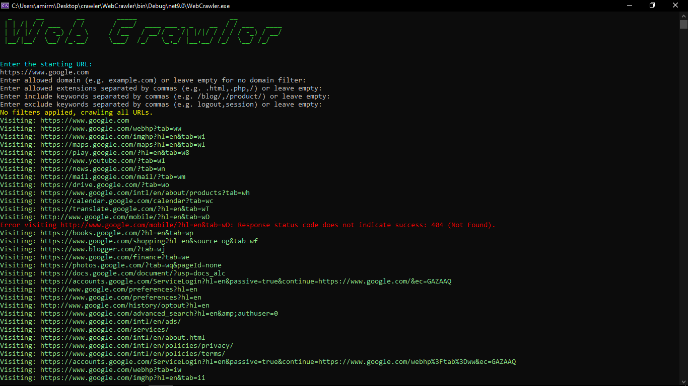

# WebCrawler

A powerful and extensible C# console web crawler that recursively visits URLs, supports filtering, and exports discovered links to a file.

## Features

* Recursive link crawling with domain-relative expansion
* URL filtering (domain, file extensions, keywords to include/exclude)
* Queue-based scheduling with concurrency control
* Export results to `crawled_links.txt`
* Interactive CLI for user-defined filters
* Console output with colored highlights

## Getting Started

### Prerequisites

* .NET 6 SDK or newer
* Internet connection

### Build and Run

```bash
cd src/WebCrawler
dotnet run
```

### Usage

1. You will be prompted to enter a starting URL.
2. Optionally, enter filtering criteria:

   * Allowed domain (e.g., `example.com`)
   * Allowed extensions (`.html`, `.php`, etc.)
   * Keywords to include or exclude in URLs
3. The crawler will process the site and save all valid links to `crawled_links.txt`.

## Customization

You can modify filters or concurrency settings inside:

* `QueueCrawlerService.cs` — crawling logic
* `UrlHelper.cs` — filtering logic

## Screenshots




## License

MIT License — use freely, modify boldly.
